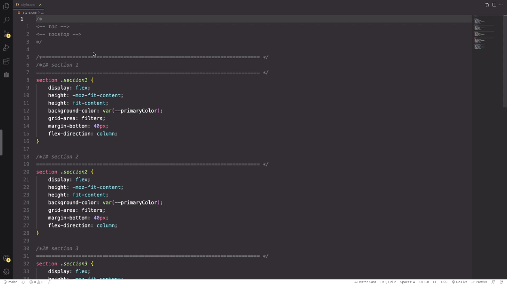

# Csstoc: Work in progress 
:warning: This bash script is attended for Unix/Linux-based OS only.
## Usages 
`csstoc [-v] [--no-color] [-h] [--css | --sass] [-s] [-f filePath ]`
### Script description
Csstoc stands for 'css table of content'. It prints a table of content inside a .css or .scss files, based on user set titles. It is inspired by the way markdown allows generating toc.

#### Usage Example

### Available options
- `-v, --verbose` Print script debug info 
- `--no-color` Disable colours in output.
- `-h, --help` Print this help and exit 
- `--css` Force csstoc to watch for css comments to build the toc   
- `--sass` Force csstoc to watch for sass/scss/less comments to build the toc   
- `-s, --standard-output` Print results to standard-output
- `-f, --file` FilePath in which to generate a toc 

### Limitations
- :warning: Concatenated flags like for example `-vs` are not supported.
- It is not possible to mix both `//`and `/*` comments type to generate a toc    

### Requirements
In order to generate a csstoc, the following conditions must apply:
1. the css/scss file must have these two tags inside à block comment to delimit where toc should be placed.
``` 
<-- toc -->
<-- tocstop -->
```
2. Titles are identified like this in `css` files:
- Level 1 Title 
`/*1# Title's name`

- Level 2 Title 
`/*2# Title's name`

- Level 3 Title 
`/*3# Title's name`

- Level 4 Title 
`/*4# Title's name`

3. Titles are identified like this in `scss, sass, less` files:
- Level 1 Title 
`//1# Title's name`

- Level 2 Title 
`//2# Title's name`

- Level 3 Title 
`//3# Title's name`

- Level 4 Title 
`//4# Title's name`
## Command line installation
1. Download the file called `csstoc` and make it executable
```
wget https://raw.githubusercontent.com/Shammas44/csstoc/main/csstoc
chmod +x csstoc
```
2. Store the newly created file somewhere available to your `$PATH` variable.
```
mv csstoc <path available to your $PATH variable>
```

### Bonus: easily accessible csstoc in Visual Studio Code
1. Install the vs code extension [Command Runner](https://github.com/edonet/vscode-command-runner).
2. In vs code, edit your `settings.json` to add your custom command.

```json 
"command-runner.commands": {
    "csstoc": "csstoc -f ${file}",
},
```

`${file}` equals to the current opened file.

3. Now you can effortlessly run your script from within the vs code command palette.